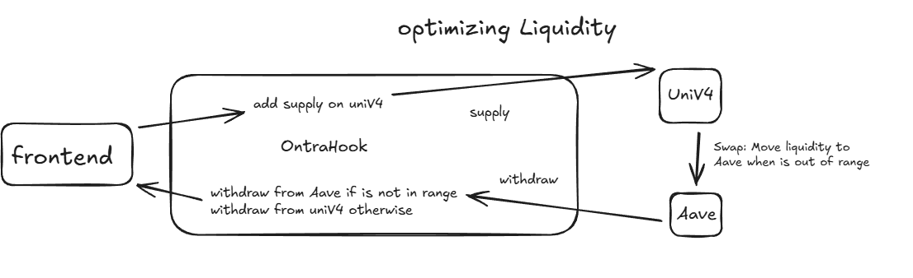

# UHI Hookathon 2025

## Project Name:

Ontra

## Description:

Ontra — The On-Chain Trading Engine Ontra is a Uniswap v4 Hook that brings institutional-grade execution directly on-chain. The core idea is a Rehypothecation Hook: any LP liquidity or order liquidity that is not currently active is automatically deposited into Aave to earn yield. When liquidity becomes needed again, the Hook withdraws it in a single batch to minimize gas. Ontra provides an on-chain execution layer supporting: Limit orders TWAP orders (30s / 1m / 5m packs) Trailing stop orders (5% / 10% / 15% pools) Hidden orders secured with Fhenix FHE All orders resting in the system earn yield through Aave. Ontra’s goal is simple: professional, efficient, privacy-enabled execution — fully on-chain.

**Implementation Note**: I set aside the initial implementation approach. The functionality to automatically migrate inactive LP positions to Aave is working. However, I moved to version 2 of the protocol, which focuses on trailing stop loss orders. Continuing with the idea of optimizing liquidity, pending positions in trailing stop loss are deposited into Aave and will be put back into Aave after their execution.

The frontend is a simple interface to demonstrate the trailing stop loss functionality. The attention was focused on the smart contract implementation. Please, consider this when reviewing the project.

No partner integrations

### Implemented version (Fully working in V2)


### Initial Goal (partially implemented in V1)



## Deployment Addresses

### Sepolia Testnet

| Contract                 | Address                                      |
| ------------------------ | -------------------------------------------- |
| **OntraV2Hook**          | `0xf31816Eeb789f4A1C13e8982E85426A9E1e59040` |
| **SwapRouterWithLocker** | `0xBD4C0Bea25557683EECCb2c5b7Bb50E3b806896a` |
| **MockAavePool**         | `0xfcAEE36D3df9d2eBf114cfcD0A628a0bbeBA2fBC` |
| **Owner**                | `0x607A577659Cad2A2799120DfdEEde39De2D38706` |

### Pool Configuration

```solidity
PoolKey({
    currency0: 0x1c7D4B196Cb0C7B01d743Fbc6116a902379C7238,
    currency1: 0x7b79995e5f793A07Bc00c21412e50Ecae098E7f9,
    fee: 0,
    tickSpacing: 60,
    hooks: 0xf31816Eeb789f4A1C13e8982E85426A9E1e59040
})
```

> **Note:** A mock Aave pool was deployed due to configuration issues with the native Aave deployment on Sepolia.

## Video Demonstration:

https://github.com/user-attachments/assets/d9708251-c19d-46bc-82c2-1967a290e144

## Specifications

- yield generated from Aave deposits during rehypothecation is returned to liquidity providers
- trailing stop lost orders are deposited into Aave until triggered and the generated yield is returned to the order placer
- executed trailing stop lost are also deposited into Aave until withdrawn by the order placer. Generated yield is returned to the owner

## Todo List

- [x] Implement addLiquidity with Aave integration
- [x] Implement removeLiquidity with Aave integration
- [x] Implement rebalanceToAave function
- [x] Implement Trailing Stop Orders with Aave integration-
- [x] Write comprehensive tests
- [x] Solidity coverage above 90%
- [ ] Implement cancelOrder function
- [ ] Integrate Fhenix FHE for Hidden Orders
- [x] Prepare documentation
- [x] Deploy to testnet
- [x] Implement front-end interface

Outside of scope for the Hookathon:

- [ ] Implement subgraph for event indexing
- [ ] Optimize gas usage
- [ ] Deploy to mainnet
- [ ] implement router for safety checks
- [ ] Implement TWAP Orders
- [ ] Implement Limit Orders

### Before production

- [ ] Extensive testing
- [ ] Increase aave integration (verify if tokens is supported for example)
- [ ] Security audit

## Documentation

To view the complete smart contract documentation:

```bash
forge doc --serve
```

The documentation will be available at `http://localhost:3000` and includes:

- Complete API reference for all contracts
- Function signatures and parameters
- NatSpec comments
- Contract inheritance diagrams
